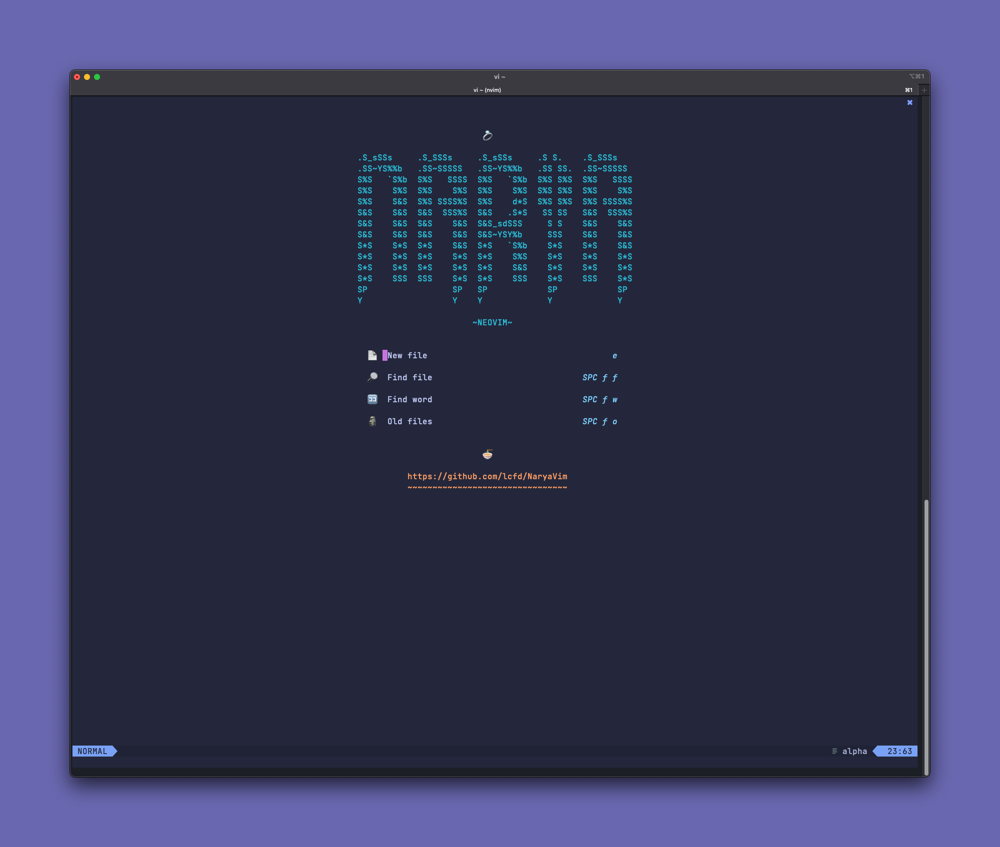
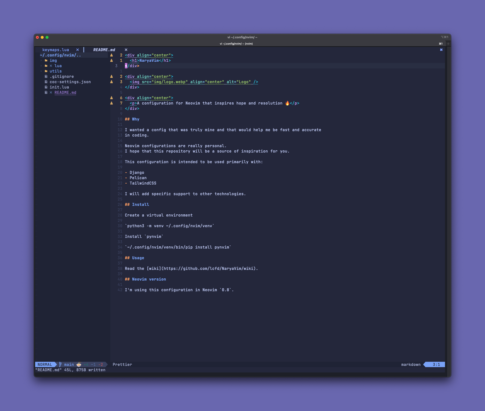

<div align="center">
  
</div>

<div align="center">
  <h1>NaryaVim</h1>
  <p><b>A configuration for Neovim that inspires hope and resolution 🔥</b></p>
</div>

<div align="center">
  
  
</div>

- [⭐️ Why](#️-why)
- [💾 Install](#-install)
- [🐛 Debuggers](#-debuggers)
- [🏋️ Usage](#️-usage)
- [🔢 Neovim version](#-neovim-version)
- [💡 Tips](#-tips)
- [📸 Screenshots](#-screenshots)
- [Others](#others)
  - [zk 4️⃣ Zettelkasten](#zk-4️⃣-zettelkasten)

## ⭐️ Why

I wanted a config that was truly mine and that would help me be fast and accurate.

Neovim configurations are _really_ personal.
I hope this repository can be more of a source of inspiration than a complete replacement.
For that purpose, there are already excellent distributions such as [LunarVim](https://www.lunarvim.org/) and [AstroNvim](https://astronvim.com/).

This configuration is intended to be used primarily with:

- [Django](https://github.com/django/django)
- [React](https://github.com/django/django)
- [Tailwind CSS](https://github.com/tailwindlabs/tailwindcss)
- [HTMX](https://github.com/bigskysoftware/htmx)
- [Alpine.js](https://github.com/alpinejs/alpine)

I will add specific support to other technologies.

## 💾 Install

Required brew packages:

```
brew install ripgrep cmake fzf
```

Clone the repository in the `nvim` config folder.

```shell
git clone https://github.com/lcfd/NaryaVim ~/.config/nvim
```

This distro may have some Python plugins in the future so you need to create a 
virtual environment and install pynvim using the commands below.

`python3 -m venv ~/.config/nvim/venv`
`~/.config/nvim/venv/bin/pip install pynvim`

## 🐛 Debuggers

They will work automagically 🧙.
Just run `PackerSync`.
Make sure to already have the `virtualenv` in the `nvim` config folder.

## 🏋️ Usage

Read the [wiki](https://github.com/lcfd/NaryaVim/wiki).

## 🔢 Neovim version

I'm using this configuration in Neovim `0.8`.

## 💡 Tips

Use it with a Nerdfont to see the logos of frameworks and languages.

For example, I suggest using JetBrainsMono Nerd.
You can download it on [nerdfonts.com](https://www.nerdfonts.com/font-downloads).

## 📸 Screenshots




## Others

### zk 4️⃣ Zettelkasten

- [Maintaining a daily journal](https://github.com/mickael-menu/zk/blob/main/docs/daily-journal.md)
