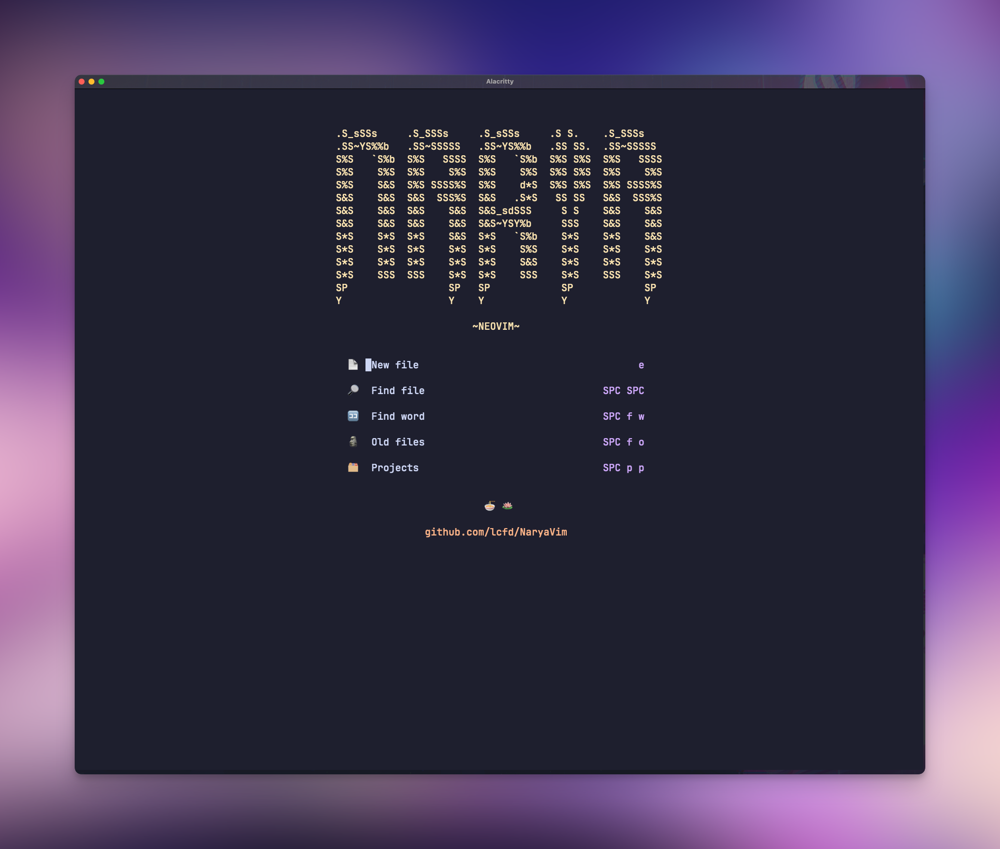
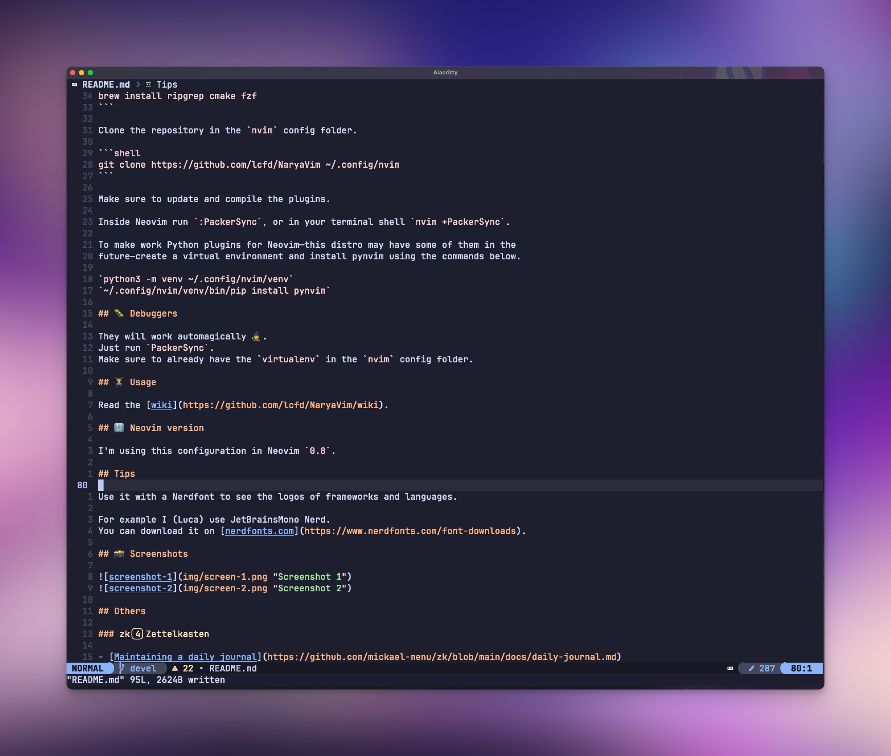

<div align="center">
  
</div>

<div align="center">
  <h1>NaryaVim</h1>
  <p><b>A configuration for Neovim that inspires hope and resolution 🔥</b></p>
</div>

<div align="center">
  
  
  
</div>

- [⭐️ Why](#️-why)
- [💾 Install](#-install)
- [🏋️‍♀️ Usage](#️️-usage)
- [🔢 Neovim version](#-neovim-version)
- [📸 Screenshots](#-screenshots)

## ⭐️ Why

I wanted a config that was truly mine and that would help me be fast and accurate.

Neovim configurations are _really_ personal.
I hope that this repository will be a source of inspiration for you.

This configuration is intended to be used primarily with:

- [Django](https://github.com/django/django)
- [HTMX](https://github.com/bigskysoftware/htmx)
- [Alpine.js](https://github.com/alpinejs/alpine)
- [Tailwind CSS](https://github.com/tailwindlabs/tailwindcss)
- [Pelican](https://github.com/getpelican/pelican)

I will add specific support to other technologies.

## 💾 Install

Clone the repository in the `nvim` config folder.

```shell
git clone https://github.com/lcfd/NaryaVim ~/.config/nvim
```

Make sure to update and compile the plugins.

Inside Neovim:

`:PackerSync`

Or in your shell:

`nvim +PackerSync`

Create a virtual environment for Python development:

`python3 -m venv ~/.config/nvim/venv`

Install `pynvim`

`~/.config/nvim/venv/bin/pip install pynvim`

Install `ltex-ls`

`brew install ltex-ls`

## 🏋️ Usage

Read the [wiki](https://github.com/lcfd/NaryaVim/wiki).

## 🔢 Neovim version

I'm using this configuration in Neovim `0.8`.

## Tips

Use it with a Nerdfont to see the logos of frameworks and languages.

For example I (Luca) use JetBrainsMono Nerd.
You can download it on [nerdfonts.com](https://www.nerdfonts.com/font-downloads).

## 📸 Screenshots



